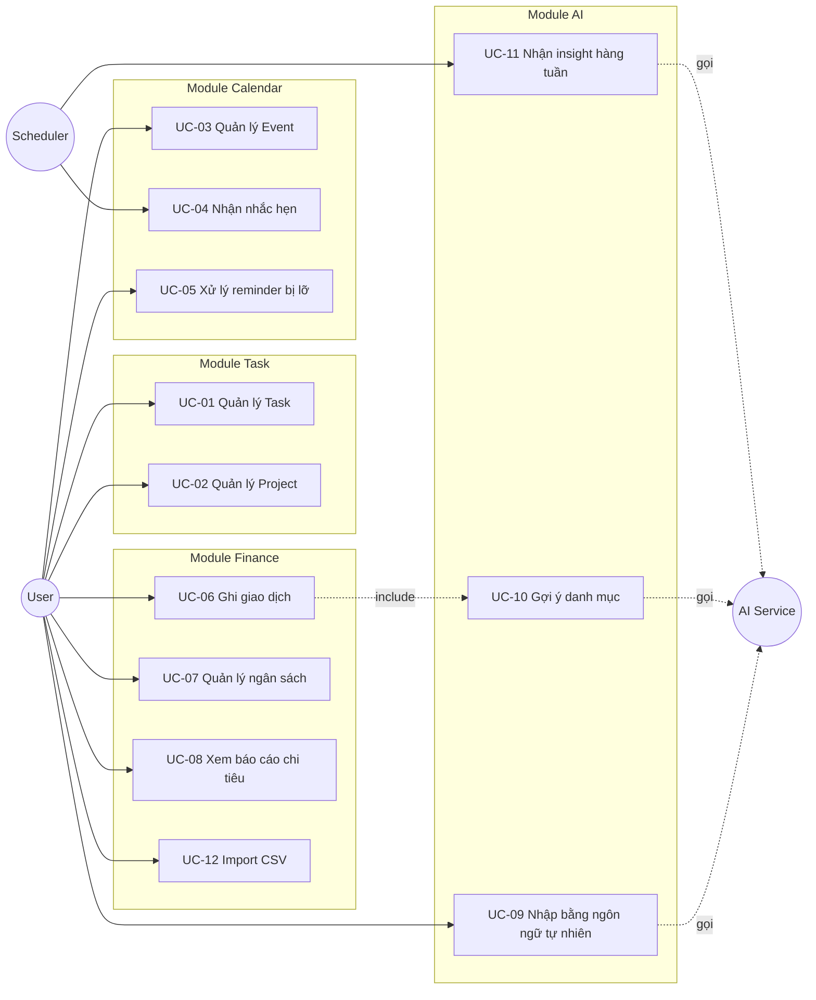

# 02 — Use Case Specification

**Actor duy nhất:** `User` — chủ sở hữu máy tính.
**Actor phụ (hệ thống):** `Scheduler` (job nội bộ), `AI Service` (LLM API bên ngoài).

---

## Sơ đồ use case tổng quan

---

## UC-01 — Quản lý Task

| Mục | Nội dung |
|---|---|
| **ID** | UC-01 |
| **Tên** | Quản lý Task |
| **Actor** | User |
| **Truy vết** | FR-TSK-01 → FR-TSK-12 |
| **Tiền điều kiện** | Ứng dụng đang chạy, database đã khởi tạo |
| **Hậu điều kiện** | Task được lưu, danh sách task cập nhật ngay lập tức |
| **Mức độ** | User goal |

### Luồng chính (tạo task)

1. User mở màn hình Tasks
2. User bấm "Thêm task" hoặc nhấn phím tắt `N`
3. Hệ thống hiển thị form tạo task, con trỏ đặt sẵn ở ô tiêu đề
4. User nhập tiêu đề (bắt buộc), tùy chọn nhập mô tả, chọn độ ưu tiên, ngày đến hạn, project, tag, ước lượng thời gian
5. User bấm "Lưu" hoặc nhấn `Ctrl+Enter`
6. Hệ thống validate dữ liệu
7. Hệ thống lưu task với trạng thái mặc định `TODO`, sinh UUID, ghi `created_at`
8. Hệ thống đóng form, hiển thị task mới trong danh sách với hiệu ứng làm nổi bật 2 giây

### Luồng phụ

**2a. Tạo nhanh từ NLP input:** User nhấn `Ctrl+Space`, gõ mô tả tự do → chuyển sang UC-09.

**4a. Tạo subtask:** User mở một task đã tồn tại, bấm "Thêm subtask". Subtask chỉ có tiêu đề và trạng thái, không cho phép lồng thêm cấp.

**5a. Lưu và tạo tiếp:** User bấm "Lưu và thêm mới", form được reset thay vì đóng.

### Luồng ngoại lệ

**E1 — Tiêu đề trống:** Hệ thống hiển thị lỗi inline "Tiêu đề không được để trống", không đóng form, giữ nguyên dữ liệu đã nhập.

**E2 — Ngày đến hạn ở quá khứ:** Hệ thống hiển thị cảnh báo (không chặn) "Ngày đến hạn đã qua, bạn có chắc không?" với nút xác nhận.

**E3 — Lỗi ghi database:** Hệ thống hiển thị toast lỗi kèm mã lỗi, giữ nguyên form và dữ liệu để user thử lại, ghi log chi tiết ra file.

### Luồng thay thế (sửa/xóa)

**Sửa:** User double-click task → form mở với dữ liệu hiện tại → sửa → lưu. Nếu đổi trạng thái sang `DONE`, hệ thống ghi `completed_at`.

**Xóa:** User bấm icon xóa → hộp thoại xác nhận → soft delete (`deleted_at = now`) → toast "Đã xóa. [Hoàn tác]" hiển thị 5 giây.

---

## UC-03 — Quản lý Event có lặp lại

| Mục | Nội dung |
|---|---|
| **ID** | UC-03 |
| **Actor** | User |
| **Truy vết** | FR-CAL-01 → FR-CAL-05 |
| **Tiền điều kiện** | Màn hình Calendar đang mở |
| **Hậu điều kiện** | Event được lưu, các instance lặp hiển thị đúng trên lịch |

### Luồng chính

1. User bấm vào một ô ngày trên lịch hoặc bấm "Thêm sự kiện"
2. Hệ thống mở form event, ngày được điền sẵn theo ô đã bấm
3. User nhập tiêu đề, thời gian bắt đầu/kết thúc, địa điểm, mô tả
4. User bật "Lặp lại" và cấu hình: tần suất, khoảng cách, ngày trong tuần, điều kiện kết thúc (theo ngày hoặc theo số lần)
5. Hệ thống sinh chuỗi RRULE từ cấu hình và hiển thị mô tả dễ hiểu bằng tiếng Việt ("Lặp lại mỗi 2 tuần vào Thứ 3, Thứ 5, đến hết 31/12/2026")
6. User thêm reminder (chọn từ danh sách khoảng thời gian trước)
7. User bấm "Lưu"
8. Hệ thống validate: thời gian kết thúc phải sau thời gian bắt đầu
9. Hệ thống lưu event master kèm RRULE (không lưu sẵn từng instance)
10. Hệ thống tính và lưu các bản ghi reminder cho các instance trong 90 ngày tới
11. Lịch render lại, các instance được sinh động (expand) khi hiển thị

### Luồng phụ

**4a. Không lặp lại:** Bỏ qua bước 4–5, `rrule` để null.

**11a. Sửa một instance của chuỗi lặp:** User sửa một instance → hệ thống hỏi "Chỉ lần này" hay "Lần này và các lần sau".
- *Chỉ lần này:* tạo bản ghi exception (`event_exception`) ghi đè instance đó
- *Lần này và sau:* cắt event gốc bằng cách thêm `UNTIL` vào RRULE cũ, tạo event mới từ ngày này với RRULE mới

### Luồng ngoại lệ

**E1 — Thời gian kết thúc trước thời gian bắt đầu:** Chặn lưu, hiện lỗi inline.

**E2 — RRULE không hợp lệ:** Hệ thống từ chối lưu, ghi log, hiện thông báo "Cấu hình lặp lại không hợp lệ".

**E3 — Xung đột lịch:** Hệ thống cảnh báo nhưng vẫn cho lưu (FR-CAL-11), liệt kê các event bị trùng.

---

## UC-04 — Nhận nhắc hẹn

| Mục | Nội dung |
|---|---|
| **ID** | UC-04 |
| **Actor** | Scheduler (chính), User (phản hồi) |
| **Truy vết** | FR-CAL-06 → FR-CAL-08, NFR-PERF-06 |
| **Tiền điều kiện** | Ứng dụng đang chạy (kể cả ở system tray), tồn tại reminder chưa kích hoạt |
| **Hậu điều kiện** | Reminder được đánh dấu đã kích hoạt, notification hiển thị |

### Luồng chính

1. Scheduler chạy mỗi 30 giây, truy vấn các reminder có `trigger_at <= now` và `status = PENDING`
2. Với mỗi reminder tìm được, backend đẩy sự kiện qua IPC lên Electron main process
3. Electron main hiển thị native OS notification: tiêu đề event, thời gian, địa điểm, kèm 2 nút hành động
4. Hệ thống cập nhật `status = FIRED`, ghi `fired_at`
5. User bấm vào notification → app được đưa lên trước, mở đúng event
6. Nếu User không tương tác, notification tự ẩn theo hành vi mặc định của hệ điều hành

### Luồng phụ

**5a. Hoãn:** User bấm "Hoãn 10 phút" → hệ thống tạo reminder mới với `trigger_at = now + 10 phút`, `status = PENDING`, đánh dấu reminder cũ là `SNOOZED`.

**5b. Đã xong:** User bấm "Đã xong" → nếu reminder gắn với task, task chuyển sang `DONE`.

### Luồng ngoại lệ

**E1 — OS chặn notification:** Hệ thống phát hiện quyền notification bị từ chối, hiển thị banner trong app hướng dẫn user bật lại trong cài đặt hệ điều hành, đồng thời fallback sang in-app toast.

**E2 — App đang đóng khi tới hạn:** Reminder giữ `status = PENDING`. Khi app mở lại → chuyển sang UC-05.

---

## UC-05 — Xử lý reminder bị lỡ

| Mục | Nội dung |
|---|---|
| **ID** | UC-05 |
| **Actor** | User |
| **Truy vết** | FR-CAL-09 |
| **Tiền điều kiện** | App vừa khởi động, tồn tại reminder `PENDING` có `trigger_at` trong quá khứ |

### Luồng chính

1. Sau khi backend sẵn sàng, hệ thống truy vấn reminder `PENDING` có `trigger_at` trong khoảng 24 giờ qua
2. Nếu có, hiển thị modal "Bạn đã bỏ lỡ N nhắc hẹn" kèm danh sách
3. Với mỗi mục, User chọn: "Bỏ qua", "Mở event", hoặc "Nhắc lại sau 1 giờ"
4. Hệ thống cập nhật trạng thái tương ứng
5. Các reminder quá 24 giờ được đánh dấu `EXPIRED` tự động, không hiển thị

---

## UC-06 — Ghi giao dịch chi tiêu

| Mục | Nội dung |
|---|---|
| **ID** | UC-06 |
| **Actor** | User |
| **Truy vết** | FR-FIN-04 → FR-FIN-07 |
| **Include** | UC-10 (Gợi ý danh mục) |
| **Tiền điều kiện** | Tồn tại ít nhất một ví và một danh mục |
| **Hậu điều kiện** | Giao dịch được lưu, số dư ví và tiến độ ngân sách cập nhật |

### Luồng chính

1. User mở màn hình Finance, bấm "Thêm giao dịch"
2. Hệ thống mở form, mặc định: loại `EXPENSE`, ngày hôm nay, ví dùng gần nhất
3. User nhập số tiền — ô nhập tự động định dạng dấu phân cách nghìn khi gõ
4. User chọn danh mục. Nếu User nhập ghi chú trước khi chọn danh mục → hệ thống gọi UC-10 để gợi ý
5. User chọn ví, nhập ghi chú, chỉnh ngày nếu cần
6. User bấm "Lưu"
7. Hệ thống validate: số tiền > 0, ví tồn tại, danh mục phù hợp với loại giao dịch
8. Hệ thống mở DB transaction, ghi bản ghi giao dịch, commit
9. Hệ thống tính lại số dư ví và mức sử dụng ngân sách của danh mục
10. Nếu ngân sách vượt ngưỡng 80% hoặc 100% → hiển thị cảnh báo tương ứng
11. Giao dịch xuất hiện đầu danh sách, dashboard cập nhật

### Luồng phụ

**1a. Nhập bằng ngôn ngữ tự nhiên:** chuyển sang UC-09.

**5a. Giao dịch chuyển khoản:** User chọn loại `TRANSFER` → form đổi thành ví nguồn + ví đích, ẩn ô danh mục.

**6a. Lưu và thêm tiếp:** Form reset, giữ nguyên ví và ngày đã chọn.

### Luồng ngoại lệ

**E1 — Số tiền ≤ 0 hoặc không phải số:** Chặn lưu, lỗi inline "Số tiền phải lớn hơn 0".

**E2 — Chuyển khoản cùng một ví:** Chặn lưu, lỗi "Ví nguồn và ví đích phải khác nhau".

**E3 — Lỗi khi ghi DB:** Rollback transaction, không có bản ghi nào được ghi một phần, hiện thông báo lỗi.

---

## UC-09 — Nhập liệu bằng ngôn ngữ tự nhiên

| Mục | Nội dung |
|---|---|
| **ID** | UC-09 |
| **Actor** | User, AI Service |
| **Truy vết** | FR-AI-01 → FR-AI-06, FR-AI-08 |
| **Tiền điều kiện** | AI đã được bật và có API key hợp lệ |
| **Hậu điều kiện** | Một bản ghi (task/event/giao dịch) được tạo **sau khi User xác nhận** |
| **Đặc biệt quan trọng** | AI KHÔNG BAO GIỜ được ghi thẳng vào DB |

### Luồng chính

1. User nhấn `Ctrl+Space` ở bất kỳ màn hình nào
2. Hệ thống mở ô nhập nổi (command palette), focus sẵn
3. User gõ câu tự do, ví dụ: `ăn trưa cơm gà 45k với team` hoặc `họp review sprint thứ 5 tuần sau 2h chiều nhắc trước 15 phút`
4. User nhấn `Enter`
5. Hệ thống hiển thị trạng thái đang xử lý
6. Backend dựng prompt gồm: câu của user, ngày giờ hiện tại, danh sách danh mục và ví hiện có, tối đa 30 giao dịch gần nhất làm few-shot
7. Backend gọi AI Service, yêu cầu trả JSON thuần theo schema đã định nghĩa
8. Backend strip markdown fence, parse JSON, validate theo schema
9. Backend map sang DTO tương ứng với `intent` được trả về
10. Frontend hiển thị **form đã điền sẵn**, các trường do AI suy ra được đánh dấu trực quan kèm mức độ tin cậy
11. User rà soát, sửa nếu cần
12. User bấm "Xác nhận" → chuyển sang luồng lưu của UC-01/UC-03/UC-06 tương ứng
13. Hệ thống ghi log vào `ai_parse_log`

### Luồng phụ

**9a. Intent = UNKNOWN:** Hệ thống hiển thị "Mình chưa hiểu ý bạn" kèm 3 nút để user tự chọn loại bản ghi muốn tạo, chuyển sang form trống có điền sẵn phần text gốc vào ô ghi chú.

**10a. Độ tin cậy thấp (< 0.6) ở một trường:** Trường đó để trống và được highlight, buộc user tự điền.

**11a. User hủy:** Nhấn `Esc`, không ghi gì vào DB, vẫn ghi log lần gọi AI.

### Luồng ngoại lệ

**E1 — Không có mạng / API timeout:** Sau 5 giây, hệ thống chuyển sang parser rule-based, hiển thị banner "Đang dùng chế độ offline, kết quả có thể kém chính xác hơn". Parser rule-based bắt: số tiền theo regex (`\d+([.,]\d+)?\s*(k|tr|triệu|nghìn|đ)?`), ngày tương đối theo từ khóa, danh mục theo bảng từ khóa.

**E2 — API trả JSON sai schema:** Thử lại tối đa 1 lần với prompt bổ sung nhấn mạnh định dạng. Vẫn sai → chuyển sang E1.

**E3 — API key không hợp lệ / hết hạn mức:** Hiển thị lỗi rõ ràng kèm link mở màn hình Settings, chuyển sang chế độ rule-based cho phiên hiện tại.

**E4 — API trả nội dung nhưng thiếu trường bắt buộc:** Điền các trường có được, để trống trường thiếu, đánh dấu để user bổ sung.

---

## UC-10 — Gợi ý danh mục tự động

| Mục | Nội dung |
|---|---|
| **ID** | UC-10 |
| **Actor** | AI Service |
| **Truy vết** | FR-AI-07 |
| **Kiểu** | Included by UC-06 |

### Luồng chính

1. User nhập ghi chú cho giao dịch nhưng chưa chọn danh mục
2. Sau 800 ms không gõ thêm (debounce), hệ thống kích hoạt gợi ý
3. Backend tìm 30 giao dịch gần nhất có ghi chú tương tự (so khớp từ khóa) làm ví dụ
4. Backend gọi AI, yêu cầu trả về tối đa 3 danh mục kèm điểm tin cậy
5. Frontend hiển thị 3 chip gợi ý ngay dưới ô danh mục
6. User bấm một chip → danh mục được điền vào form

### Luồng ngoại lệ

**E1 — AI không khả dụng:** Bỏ qua im lặng, không hiện gợi ý, không báo lỗi (đây là tính năng phụ trợ, không được làm phiền user).

**E2 — Đã có đủ dữ liệu lịch sử khớp chính xác:** Bỏ qua AI, dùng luôn danh mục của giao dịch có ghi chú trùng khớp gần nhất (tiết kiệm chi phí API).

---

## UC-11 — Nhận insight hàng tuần

| Mục | Nội dung |
|---|---|
| **ID** | UC-11 |
| **Actor** | Scheduler, AI Service |
| **Truy vết** | FR-AI-11 |
| **Tiền điều kiện** | Có ít nhất 7 ngày dữ liệu, AI được bật |

### Luồng chính

1. Scheduler kích hoạt vào 20:00 Chủ nhật hàng tuần (cấu hình được trong Settings)
2. Hệ thống tổng hợp dữ liệu tuần: tổng thu/chi theo danh mục, so sánh tuần trước, ngân sách vượt hạn mức, số task hoàn thành/trễ hạn, task bị dời deadline nhiều lần
3. Hệ thống gửi **dữ liệu đã tổng hợp** (không gửi từng giao dịch chi tiết) lên AI
4. AI trả về 3–5 nhận xét ngắn dạng JSON, mỗi nhận xét có: nội dung, mức độ (INFO/WARNING), module liên quan
5. Hệ thống lưu vào bảng `insight`
6. Lần mở app tiếp theo, hiển thị badge trên Dashboard
7. User mở xem, có thể đánh dấu "Hữu ích" / "Không hữu ích" để tinh chỉnh prompt về sau

### Luồng ngoại lệ

**E1 — Không đủ dữ liệu:** Bỏ qua tuần đó, không sinh insight, không thông báo.

**E2 — App không chạy vào thời điểm hẹn:** Job chạy bù ở lần khởi động tiếp theo nếu chưa có insight cho tuần đó.

---

## UC-12 — Import giao dịch từ CSV

| Mục | Nội dung |
|---|---|
| **ID** | UC-12 |
| **Actor** | User |
| **Truy vết** | FR-FIN-14, FR-FIN-15 |

### Luồng chính

1. User vào Finance → "Import CSV", chọn file
2. Hệ thống đọc 5 dòng đầu, hiển thị bảng xem trước
3. User ánh xạ từng cột trong file với trường của hệ thống (ngày, số tiền, mô tả, loại)
4. User chọn ví đích và định dạng ngày
5. Hệ thống parse toàn bộ file, phát hiện các dòng lỗi
6. Hệ thống đối chiếu trùng lặp: cùng số tiền và ngày lệch không quá 1 ngày với giao dịch đã có
7. Hệ thống hiển thị tổng kết: N hợp lệ, M nghi trùng, K lỗi
8. User rà soát các dòng nghi trùng, chọn giữ hoặc bỏ từng dòng
9. User xác nhận import
10. Hệ thống ghi tất cả trong một DB transaction, hiển thị kết quả

### Luồng ngoại lệ

**E1 — File sai định dạng hoặc rỗng:** Từ chối, nêu rõ lý do.

**E2 — Encoding không phải UTF-8:** Thử tự phát hiện, nếu tiếng Việt bị lỗi font thì cho user chọn encoding thủ công (UTF-8, Windows-1258).

**E3 — Lỗi giữa chừng:** Rollback toàn bộ, không import một phần.
