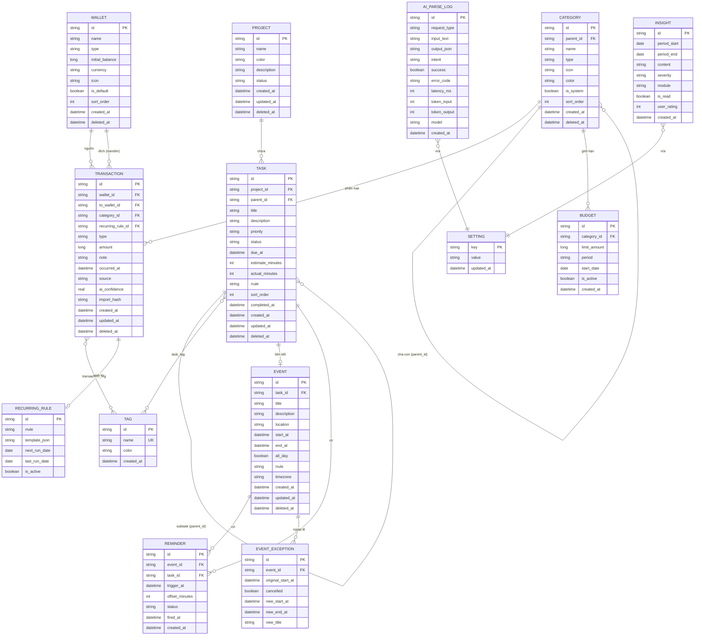
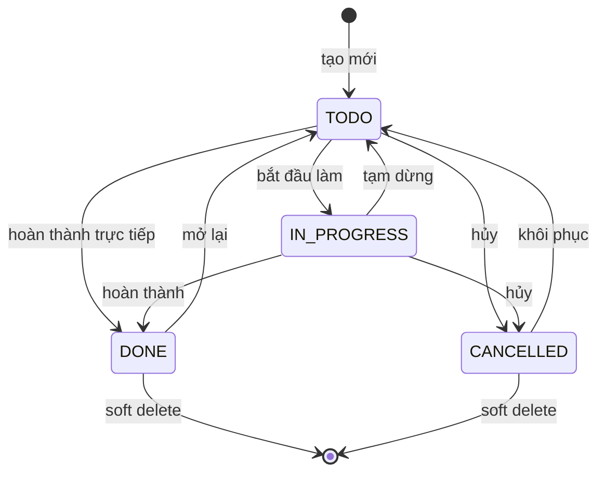
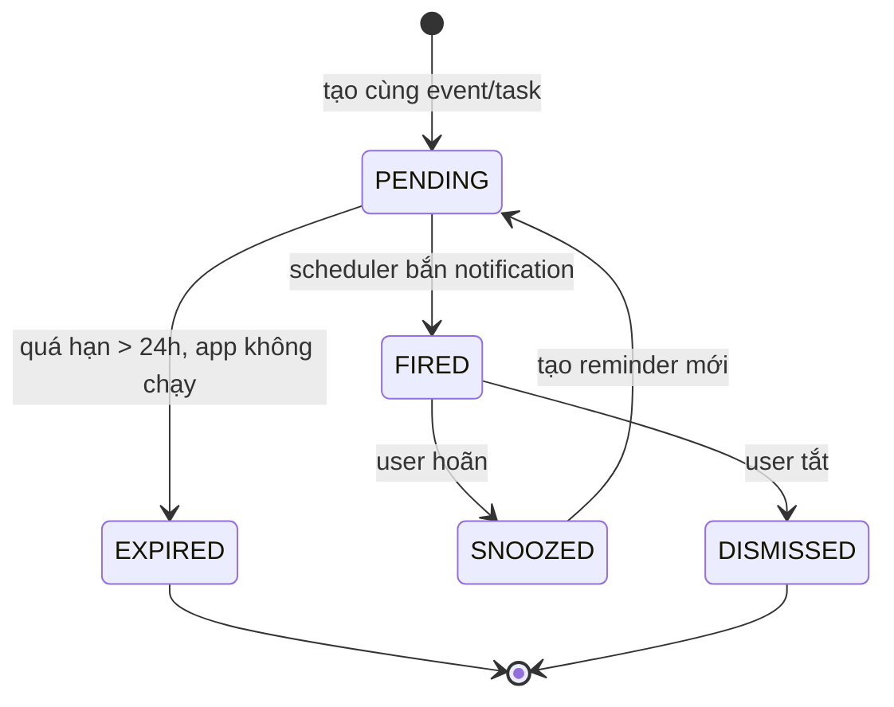

# 03 — Data Model & ERD

**Database:** SQLite 3 (WAL mode) — file `data/lifehub.db`
**Migration tool:** Flyway
**Quy ước đặt tên:** `snake_case`, bảng số ít, khóa chính luôn tên `id`

---

## 1. Sơ đồ ERD tổng thể



---

## 2. Từ điển dữ liệu

### 2.1. `project`

| Cột | Kiểu | Null | Mặc định | Ghi chú |
|---|---|---|---|---|
| id | TEXT | N | — | UUID v7, PK |
| name | TEXT | N | — | Tối đa 100 ký tự |
| color | TEXT | N | `#6366f1` | Mã hex |
| description | TEXT | Y | NULL | |
| status | TEXT | N | `ACTIVE` | `ACTIVE` \| `ARCHIVED` |
| created_at | TIMESTAMP | N | now | UTC |
| updated_at | TIMESTAMP | N | now | UTC |
| deleted_at | TIMESTAMP | Y | NULL | Soft delete |

**Index:** `idx_project_status` trên `(status, deleted_at)`

### 2.2. `task`

| Cột | Kiểu | Null | Mặc định | Ghi chú |
|---|---|---|---|---|
| id | TEXT | N | — | PK |
| project_id | TEXT | Y | NULL | FK → project.id, ON DELETE SET NULL |
| parent_id | TEXT | Y | NULL | FK → task.id, chỉ 1 cấp |
| title | TEXT | N | — | 1–255 ký tự |
| description | TEXT | Y | NULL | |
| priority | TEXT | N | `MEDIUM` | `LOW`\|`MEDIUM`\|`HIGH`\|`URGENT` |
| status | TEXT | N | `TODO` | `TODO`\|`IN_PROGRESS`\|`DONE`\|`CANCELLED` |
| due_at | TIMESTAMP | Y | NULL | UTC |
| estimate_minutes | INTEGER | Y | NULL | > 0 |
| actual_minutes | INTEGER | Y | NULL | Tích lũy từ pomodoro (phase sau) |
| rrule | TEXT | Y | NULL | RFC 5545 |
| sort_order | INTEGER | N | 0 | Thứ tự thủ công trong Kanban |
| completed_at | TIMESTAMP | Y | NULL | Ghi khi status → DONE |
| created_at | TIMESTAMP | N | now | |
| updated_at | TIMESTAMP | N | now | |
| deleted_at | TIMESTAMP | Y | NULL | |

**Ràng buộc:**
- `CHECK (parent_id IS NULL OR parent_id != id)`
- `CHECK (priority IN ('LOW','MEDIUM','HIGH','URGENT'))`
- `CHECK (status IN ('TODO','IN_PROGRESS','DONE','CANCELLED'))`
- Ràng buộc nghiệp vụ (kiểm ở service layer): task có `parent_id` không được có subtask riêng

**Index:**
- `idx_task_due` trên `(due_at, deleted_at)`
- `idx_task_status` trên `(status, deleted_at)`
- `idx_task_project` trên `(project_id)`

### 2.3. `event`

| Cột | Kiểu | Null | Mặc định | Ghi chú |
|---|---|---|---|---|
| id | TEXT | N | — | PK |
| task_id | TEXT | Y | NULL | FK → task.id |
| title | TEXT | N | — | |
| description | TEXT | Y | NULL | |
| location | TEXT | Y | NULL | |
| start_at | TIMESTAMP | N | — | UTC |
| end_at | TIMESTAMP | N | — | UTC, phải > start_at |
| all_day | BOOLEAN | N | 0 | |
| rrule | TEXT | Y | NULL | NULL = không lặp |
| timezone | TEXT | N | `Asia/Ho_Chi_Minh` | IANA tz |
| created_at | TIMESTAMP | N | now | |
| updated_at | TIMESTAMP | N | now | |
| deleted_at | TIMESTAMP | Y | NULL | |

**Ràng buộc:** `CHECK (end_at > start_at)`
**Index:** `idx_event_range` trên `(start_at, end_at, deleted_at)`

**Quyết định thiết kế quan trọng:** Event lặp lại **KHÔNG** được materialize thành nhiều bản ghi. Chỉ lưu một bản ghi master kèm `rrule`. Các instance được sinh động tại thời điểm truy vấn bằng thư viện RRULE, giới hạn theo khoảng thời gian đang hiển thị. Điều này tránh phình database và cho phép sửa quy luật lặp mà không phải cập nhật hàng nghìn bản ghi.

### 2.4. `event_exception`

Lưu các trường hợp một instance cụ thể của chuỗi lặp bị hủy hoặc sửa riêng.

| Cột | Kiểu | Null | Ghi chú |
|---|---|---|---|
| id | TEXT | N | PK |
| event_id | TEXT | N | FK → event.id, ON DELETE CASCADE |
| original_start_at | TIMESTAMP | N | Mốc thời gian gốc của instance bị ghi đè |
| cancelled | BOOLEAN | N | 1 = instance này bị hủy |
| new_start_at | TIMESTAMP | Y | Nếu bị dời |
| new_end_at | TIMESTAMP | Y | |
| new_title | TEXT | Y | |

**Unique:** `(event_id, original_start_at)`

### 2.5. `reminder`

| Cột | Kiểu | Null | Mặc định | Ghi chú |
|---|---|---|---|---|
| id | TEXT | N | — | PK |
| event_id | TEXT | Y | NULL | FK → event.id |
| task_id | TEXT | Y | NULL | FK → task.id |
| trigger_at | TIMESTAMP | N | — | Thời điểm cần bắn, UTC |
| offset_minutes | INTEGER | N | 15 | Số phút trước sự kiện |
| status | TEXT | N | `PENDING` | `PENDING`\|`FIRED`\|`SNOOZED`\|`DISMISSED`\|`EXPIRED` |
| fired_at | TIMESTAMP | Y | NULL | |
| created_at | TIMESTAMP | N | now | |

**Ràng buộc:** `CHECK ((event_id IS NOT NULL) OR (task_id IS NOT NULL))` — phải gắn với ít nhất một trong hai
**Index:** `idx_reminder_pending` trên `(status, trigger_at)` — index quan trọng nhất cho scheduler

### 2.6. `wallet`

| Cột | Kiểu | Null | Mặc định | Ghi chú |
|---|---|---|---|---|
| id | TEXT | N | — | PK |
| name | TEXT | N | — | Unique khi chưa xóa |
| type | TEXT | N | `CASH` | `CASH`\|`BANK`\|`E_WALLET`\|`CREDIT` |
| initial_balance | INTEGER | N | 0 | **Đơn vị đồng, số nguyên** |
| currency | TEXT | N | `VND` | ISO 4217 |
| icon | TEXT | Y | NULL | |
| is_default | BOOLEAN | N | 0 | Chỉ một ví được là mặc định |
| sort_order | INTEGER | N | 0 | |
| created_at | TIMESTAMP | N | now | |
| deleted_at | TIMESTAMP | Y | NULL | |

**Quyết định thiết kế:** Số dư hiện tại **không lưu trong bảng**. Tính bằng công thức:

```sql
initial_balance
  + SUM(giao dịch INCOME vào ví này)
  - SUM(giao dịch EXPENSE từ ví này)
  - SUM(giao dịch TRANSFER có wallet_id = ví này)
  + SUM(giao dịch TRANSFER có to_wallet_id = ví này)
```

Lý do: tránh sai lệch dữ liệu khi sửa/xóa giao dịch. Nếu về sau có vấn đề hiệu năng, thêm bảng snapshot theo tháng, đừng lưu số dư cứng.

### 2.7. `category`

| Cột | Kiểu | Null | Mặc định | Ghi chú |
|---|---|---|---|---|
| id | TEXT | N | — | PK |
| parent_id | TEXT | Y | NULL | FK → category.id, tối đa 2 cấp |
| name | TEXT | N | — | |
| type | TEXT | N | `EXPENSE` | `INCOME`\|`EXPENSE` |
| icon | TEXT | Y | NULL | Tên icon lucide-react |
| color | TEXT | N | `#94a3b8` | |
| is_system | BOOLEAN | N | 0 | 1 = danh mục mặc định, không cho xóa |
| sort_order | INTEGER | N | 0 | |
| created_at | TIMESTAMP | N | now | |
| deleted_at | TIMESTAMP | Y | NULL | |

**Unique:** `(name, parent_id, type)` khi `deleted_at IS NULL`

**Bộ danh mục mặc định (seed data, `is_system = 1`):**

*Chi:* Ăn uống (Ăn ngoài, Đi chợ, Cà phê), Di chuyển (Xăng xe, Grab/Taxi, Gửi xe), Nhà ở (Tiền nhà, Điện nước, Internet), Mua sắm (Quần áo, Đồ điện tử, Đồ dùng), Sức khỏe, Giải trí, Học tập, Subscription, Khác

*Thu:* Lương, Thưởng, Freelance, Đầu tư, Khác

### 2.8. `transaction`

> **Lưu ý:** `transaction` là từ khóa SQL. Trong Java, đặt tên entity là `MoneyTransaction`, dùng `@Table(name = "\"transaction\"")`. Hoặc đổi tên bảng thành `txn` — nếu chọn phương án này, phải cập nhật tài liệu này và **báo lại cho user**.

| Cột | Kiểu | Null | Mặc định | Ghi chú |
|---|---|---|---|---|
| id | TEXT | N | — | PK |
| wallet_id | TEXT | N | — | FK → wallet.id. Với TRANSFER là ví nguồn |
| to_wallet_id | TEXT | Y | NULL | Chỉ dùng khi type = TRANSFER |
| category_id | TEXT | Y | NULL | Bắt buộc khi type ≠ TRANSFER |
| recurring_rule_id | TEXT | Y | NULL | FK, nếu sinh tự động |
| type | TEXT | N | `EXPENSE` | `INCOME`\|`EXPENSE`\|`TRANSFER` |
| amount | INTEGER | N | — | **> 0, đơn vị đồng** |
| note | TEXT | Y | NULL | |
| occurred_at | TIMESTAMP | N | now | Thời điểm giao dịch thực tế |
| source | TEXT | N | `MANUAL` | `MANUAL`\|`AI_PARSE`\|`CSV_IMPORT`\|`RECURRING` |
| ai_confidence | REAL | Y | NULL | 0.0–1.0, chỉ khi source = AI_PARSE |
| import_hash | TEXT | Y | NULL | Hash dùng chống trùng khi import |
| created_at | TIMESTAMP | N | now | |
| updated_at | TIMESTAMP | N | now | |
| deleted_at | TIMESTAMP | Y | NULL | |

**Ràng buộc:**
- `CHECK (amount > 0)`
- `CHECK (type IN ('INCOME','EXPENSE','TRANSFER'))`
- `CHECK (type != 'TRANSFER' OR (to_wallet_id IS NOT NULL AND to_wallet_id != wallet_id))`
- `CHECK (type = 'TRANSFER' OR category_id IS NOT NULL)`

**Index:**
- `idx_txn_occurred` trên `(occurred_at DESC, deleted_at)` — dùng nhiều nhất
- `idx_txn_category` trên `(category_id, occurred_at)`
- `idx_txn_wallet` trên `(wallet_id, occurred_at)`
- `idx_txn_import_hash` trên `(import_hash)`

### 2.9. `budget`

| Cột | Kiểu | Null | Mặc định | Ghi chú |
|---|---|---|---|---|
| id | TEXT | N | — | PK |
| category_id | TEXT | N | — | FK → category.id |
| limit_amount | INTEGER | N | — | > 0, đơn vị đồng |
| period | TEXT | N | `MONTHLY` | `WEEKLY`\|`MONTHLY`\|`YEARLY` |
| start_date | DATE | N | — | Mốc bắt đầu chu kỳ đầu tiên |
| is_active | BOOLEAN | N | 1 | |
| created_at | TIMESTAMP | N | now | |

**Unique:** `(category_id, period)` khi `is_active = 1`

### 2.10. `ai_parse_log`

| Cột | Kiểu | Null | Ghi chú |
|---|---|---|---|
| id | TEXT | N | PK |
| request_type | TEXT | N | `NL_PARSE`\|`CATEGORY_SUGGEST`\|`WEEKLY_INSIGHT` |
| input_text | TEXT | Y | Câu gốc của user |
| output_json | TEXT | Y | JSON thô AI trả về |
| intent | TEXT | Y | `TASK`\|`EVENT`\|`TRANSACTION`\|`UNKNOWN` |
| success | BOOLEAN | N | |
| error_code | TEXT | Y | `TIMEOUT`\|`INVALID_JSON`\|`AUTH`\|`RATE_LIMIT`\|`UNKNOWN` |
| latency_ms | INTEGER | Y | |
| token_input | INTEGER | Y | |
| token_output | INTEGER | Y | |
| model | TEXT | Y | Tên model đã dùng |
| created_at | TIMESTAMP | N | |

**Chính sách lưu trữ:** Tự động xóa bản ghi cũ hơn 90 ngày khi khởi động app.

### 2.11. `setting`

Bảng key-value đơn giản.

| key | Giá trị mẫu | Ghi chú |
|---|---|---|
| `app.theme` | `SYSTEM` | `LIGHT`\|`DARK`\|`SYSTEM` |
| `app.timezone` | `Asia/Ho_Chi_Minh` | |
| `app.week_start` | `MONDAY` | |
| `app.currency` | `VND` | |
| `ai.enabled` | `true` | |
| `ai.model` | — | Tên model do user chọn |
| `ai.weekly_insight_cron` | `0 0 20 * * SUN` | |
| `backup.dir` | `data/backups` | |
| `backup.keep_count` | `30` | |
| `db.schema_version` | — | Do Flyway quản lý |

> **API key KHÔNG lưu ở bảng này.** Lưu qua Electron `safeStorage`, backend nhận qua biến môi trường lúc spawn.

---

## 3. Sơ đồ chuyển trạng thái

### 3.1. Task



### 3.2. Reminder



---

## 4. Danh sách migration Flyway

| File | Phase | Nội dung |
|---|---|---|
| `V1__init_core.sql` | 0 | Bảng `setting`, bật WAL, cấu hình pragma |
| `V2__task_module.sql` | 1 | `project`, `task`, `tag`, `task_tag` |
| `V3__calendar_module.sql` | 2 | `event`, `event_exception`, `reminder` |
| `V4__finance_module.sql` | 3 | `wallet`, `category`, `transaction`, `budget`, `transaction_tag`, `recurring_rule` |
| `V5__seed_categories.sql` | 3 | Seed danh mục hệ thống |
| `V6__ai_module.sql` | 4 | `ai_parse_log` |
| `V7__insight.sql` | 5 | `insight` |

**Quy tắc:** Không bao giờ sửa migration đã chạy. Sai thì tạo migration mới để sửa.

> **Sửa đổi so với bản 1.0 (user duyệt 2026-09-08):** `recurring_rule` chuyển từ `V7`
> sang `V4`. Lý do: `transaction.recurring_rule_id` là khóa ngoại được tạo trong `V4`
> (Phase 3) và FR-FIN-13 thuộc Phase 3 — với `PRAGMA foreign_keys = ON`, `V4` sẽ
> migrate thất bại nếu bảng đích chưa tồn tại. `V7` đổi tên thành `V7__insight.sql`.

---

## 5. Cấu hình SQLite bắt buộc

Chạy ngay khi mở connection:

```sql
PRAGMA journal_mode = WAL;        -- chống hỏng file khi tắt đột ngột
PRAGMA foreign_keys = ON;         -- SQLite mặc định TẮT, phải bật thủ công
PRAGMA busy_timeout = 5000;       -- tránh lỗi "database is locked"
PRAGMA synchronous = NORMAL;      -- cân bằng an toàn và tốc độ với WAL
```

`PRAGMA foreign_keys = ON` là bẫy phổ biến nhất khi dùng SQLite — nếu quên, mọi ràng buộc khóa ngoại sẽ bị bỏ qua âm thầm.

---

## 6. Phụ lục — sửa đổi đã được user duyệt (2026-09-08)

Các mục dưới đây đã được user duyệt ở phiên rà soát tài liệu trước Phase 0. Mỗi mục
được áp dụng **khi tới phase tương ứng**; agent phải đọc phụ lục này cùng với §2
trước khi viết migration của phase đó. Chi tiết lý do xem `PROGRESS.md`.

| # | Phase | Bảng | Sửa đổi |
|---|---|---|---|
| C-3 | 1, 3, 5 | `tag`, `task_tag`, `transaction_tag`, `recurring_rule`, `insight` | Năm bảng này chỉ có trong ERD §1, chưa có từ điển ở §2. Định nghĩa chốt: hai bảng nối dùng khóa chính tổ hợp `(task_id, tag_id)` / `(transaction_id, tag_id)`, cả hai cột `NOT NULL`, FK `ON DELETE CASCADE`, không có cột phụ. `tag`, `recurring_rule`, `insight` lấy đúng danh sách cột trong ERD §1. |
| C-4 | 3 | `category` | Unique `(name, parent_id, type)` phải tạo trên `COALESCE(parent_id, '')`. SQLite coi các giá trị NULL là khác nhau trong unique index, nên bản gốc sẽ cho phép hai danh mục gốc trùng tên. |
| C-5 | 3 | `wallet`, `category`, `budget` | Bổ sung `updated_at TIMESTAMP NOT NULL DEFAULT now` (cả ba bảng đều có endpoint `PATCH`) và `deleted_at TIMESTAMP NULL` cho `budget` (có endpoint `DELETE`, phải là soft delete theo `AGENTS.md` §3.3). |
| C-5b | 1 | `tag` | Ngoại lệ có chủ đích: `tag` **hard delete**. Tag chỉ là nhãn, `DELETE /tags/{id}` gỡ khỏi mọi task/giao dịch qua `ON DELETE CASCADE` của bảng nối. |
| C-6 | 3 | `wallet` | `DELETE /wallets/{id}` là soft delete, nhưng bị chặn (409 `CONFLICT`) khi còn giao dịch chưa xóa tham chiếu tới ví. |
| M-13 | 2 | `event` | Quy ước sự kiện cả ngày: `all_day = 1` lưu `start_at` = 00:00:00 giờ địa phương và `end_at` = 00:00:00 giờ địa phương của **ngày kế tiếp**, để thỏa `CHECK (end_at > start_at)`. |
| M-14 | 1 | `task` | `actual_minutes` được tạo trong `V2` theo đúng schema chốt nhưng **không dùng và không expose ra API** ở v1.0 — chưa có FR/use case nào cho pomodoro. Ghi vào "Nợ kỹ thuật". |
| M-15 | 3 | `wallet` | `name` "unique khi chưa xóa" cần index rõ ràng: `CREATE UNIQUE INDEX idx_wallet_name ON wallet(name) WHERE deleted_at IS NULL`. |
| M-19 | 2 | `event_exception` | Bảng chỉ ghi đè được `new_start_at`, `new_end_at`, `new_title`. Vì vậy scope `THIS_ONLY` trên UI chỉ cho sửa thời gian và tiêu đề; sửa `description`/`location` bắt buộc dùng scope `ALL`. |
| M-21 | 3, 5 | `budget`, `recurring_rule`, `insight` | SQLite không có kiểu `DATE`. Các cột `start_date`, `next_run_date`, `last_run_date`, `period_start`, `period_end` lưu `TEXT` định dạng `yyyy-MM-dd`, map sang `LocalDate`. |
