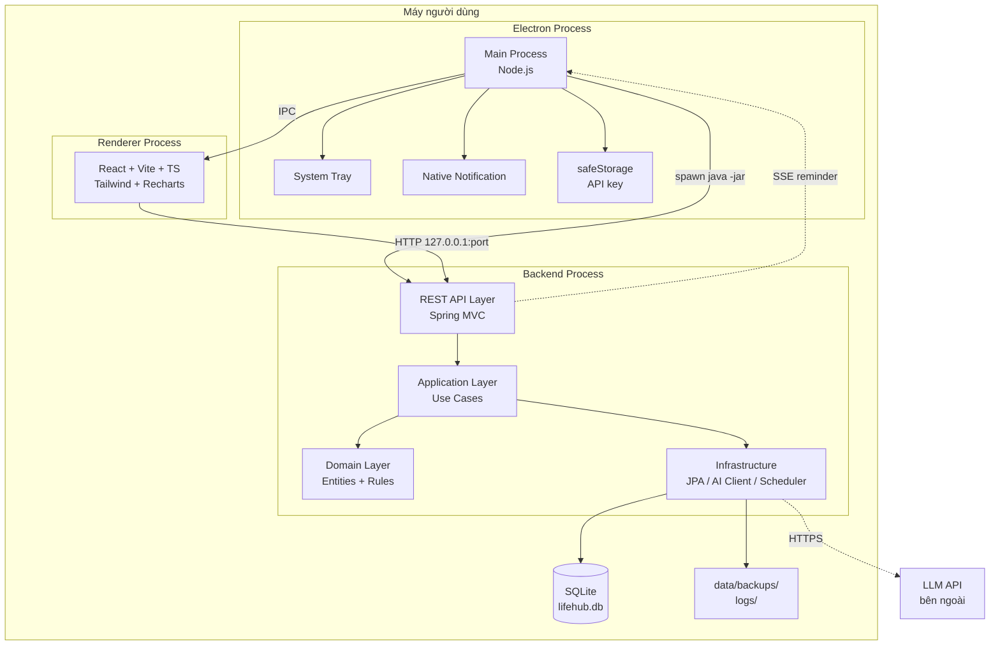
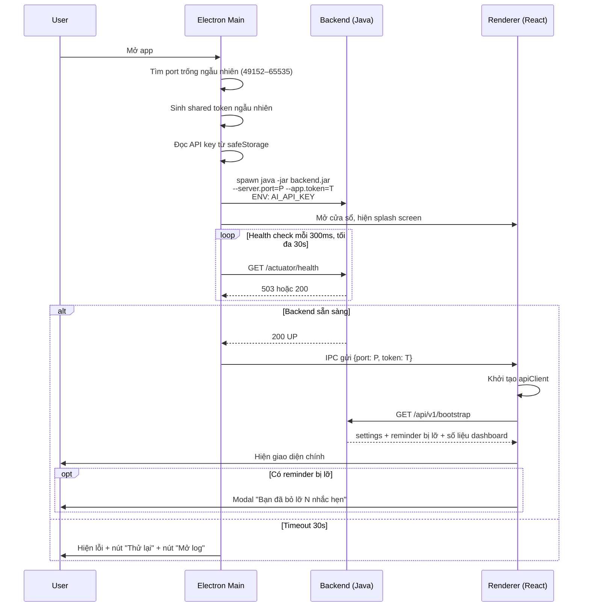
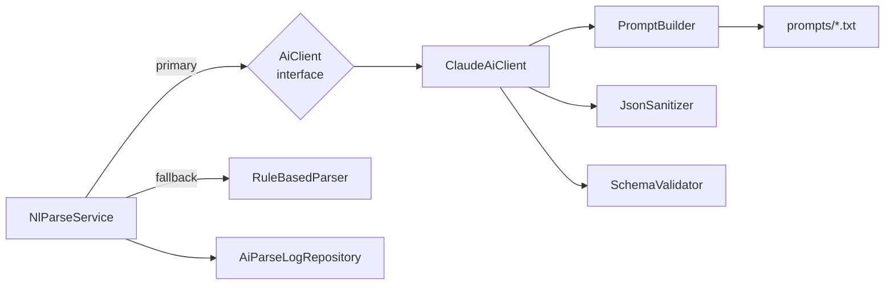

# 04 — Architecture Document

---

## 1. Sơ đồ kiến trúc tổng thể



---

## 2. Tech stack — ĐÃ CHỐT, KHÔNG ĐỔI

### Backend

| Thành phần | Lựa chọn | Phiên bản |
|---|---|---|
| Ngôn ngữ | Java | 21 (LTS) |
| Framework | Spring Boot | 3.3.x |
| ORM | Spring Data JPA + Hibernate | 6.x |
| Database | SQLite | 3.45+ |
| JDBC Driver | `org.xerial:sqlite-jdbc` | 3.45+ |
| Hibernate dialect | `org.hibernate.community.dialect.SQLiteDialect` | từ `hibernate-community-dialects` |
| Migration | Flyway | 10.x |
| Validation | Spring Boot Validation (Jakarta) | — |
| JSON | Jackson | — |
| RRULE | `com.github.ical4j:ical4j` hoặc `org.dmfs:lib-recur` | — |
| Test | JUnit 5, Mockito, AssertJ, Testcontainers không cần (dùng SQLite in-memory) | — |
| Excel export | Apache POI | 5.x |
| PDF export | OpenPDF hoặc iText 7 (chú ý license) | — |
| ID generator | `com.fasterxml.uuid:java-uuid-generator` (UUID v7) | 5.x |
| Actuator | `spring-boot-starter-actuator` (chỉ bật `health`) | — |
| Build | Maven (qua Maven Wrapper `./mvnw`) | 3.9+ |

### Frontend

| Thành phần | Lựa chọn |
|---|---|
| Framework | React 18 + TypeScript 5 |
| Build tool | Vite 5 |
| CSS | Tailwind CSS 3 |
| Component | shadcn/ui |
| Icon | lucide-react |
| State server | TanStack Query v5 |
| State client | Zustand |
| Form | React Hook Form + Zod |
| Chart | Recharts |
| Lịch | react-big-calendar hoặc tự dựng bằng date-fns |
| Ngày giờ | date-fns + date-fns-tz |
| Test | Vitest + React Testing Library |

### Desktop shell

| Thành phần | Lựa chọn |
|---|---|
| Shell | Electron 30+ |
| Đóng gói | electron-builder |
| Java runtime | JRE rút gọn tạo bằng `jlink` |

---

## 3. Kiến trúc phân lớp backend

Áp dụng **Layered Architecture** với nguyên tắc phụ thuộc hướng vào trong.

```
┌─────────────────────────────────────────────────┐
│  api/            REST Controller, DTO, Mapper   │
│                  Chỉ nói chuyện với application  │
├─────────────────────────────────────────────────┤
│  application/    Service, Use Case, Command      │
│                  Điều phối, quản lý transaction  │
├─────────────────────────────────────────────────┤
│  domain/         Entity, Enum, Value Object,     │
│                  Domain Service, Repository IF   │
│                  KHÔNG phụ thuộc framework       │
├─────────────────────────────────────────────────┤
│  infrastructure/ JPA Repo Impl, AI Client,       │
│                  Scheduler, File, Export         │
└─────────────────────────────────────────────────┘
```

### Luật phụ thuộc — bắt buộc tuân thủ

1. `api` → `application` → `domain`. Không được nhảy cóc.
2. `infrastructure` implement interface do `domain` định nghĩa (Dependency Inversion).
3. **Controller không bao giờ inject Repository trực tiếp.**
4. Entity JPA không bao giờ được trả thẳng ra ngoài controller — luôn map sang DTO.
5. `@Transactional` đặt ở tầng `application`, không đặt ở controller hay repository.

---

## 4. Cấu trúc thư mục — KHÔNG ĐỔI

```
lifehub/
├─ AGENTS.md
├─ README.md
├─ PROGRESS.md                    # agent cập nhật sau mỗi phase
├─ docs/
│  ├─ 01-SRS.md ... 08-TEST-PLAN.md
│  └─ uat/
│     ├─ phase-0-UAT.md
│     └─ phase-1-UAT.md ...
│
├─ backend/
│  ├─ pom.xml
│  └─ src/
│     ├─ main/
│     │  ├─ java/com/lifehub/
│     │  │  ├─ LifeHubApplication.java
│     │  │  ├─ api/
│     │  │  │  ├─ task/       TaskController, TaskDto, TaskMapper
│     │  │  │  ├─ calendar/
│     │  │  │  ├─ finance/
│     │  │  │  ├─ ai/
│     │  │  │  ├─ report/
│     │  │  │  ├─ system/     BootstrapController, SettingsController,
│     │  │  │  │             BackupController, ImportController
│     │  │  │  └─ common/     ApiResponse, GlobalExceptionHandler, ErrorCode,
│     │  │  │                 AppTokenFilter
│     │  │  ├─ application/
│     │  │  │  ├─ task/       TaskService, TaskQueryService
│     │  │  │  ├─ calendar/   EventService, ReminderService, RecurrenceExpander
│     │  │  │  ├─ finance/    TransactionService, BudgetService, WalletBalanceCalculator
│     │  │  │  ├─ ai/         NlParseService, CategorySuggestService, InsightService
│     │  │  │  ├─ report/     ExportService, DataAggregator
│     │  │  │  └─ system/     SettingService, BootstrapService,
│     │  │  │                 BackupService, ImportService
│     │  │  ├─ domain/
│     │  │  │  ├─ task/       Task, Project, Tag, TaskStatus, Priority, TaskRepository
│     │  │  │  ├─ calendar/   Event, EventException, Reminder, ReminderStatus
│     │  │  │  ├─ finance/    MoneyTransaction, Wallet, Category, Budget, Money
│     │  │  │  ├─ ai/         ParseIntent, ParseResult, AiClient (interface)
│     │  │  │  ├─ system/     Setting, Insight, RecurringRule + Repository IF
│     │  │  │  └─ common/     BaseEntity, DomainException, IdGenerator
│     │  │  └─ infrastructure/
│     │  │     ├─ persistence/  JpaTaskRepository, ... + SqliteConfig
│     │  │     ├─ ai/           ClaudeAiClient, PromptBuilder, JsonSanitizer,
│     │  │     │                RuleBasedParser (fallback)
│     │  │     ├─ scheduler/    ReminderScheduler, InsightScheduler, BackupScheduler
│     │  │     ├─ notification/ ReminderSseEmitter
│     │  │     └─ export/       ExcelExporter, PdfExporter
│     │  └─ resources/
│     │     ├─ application.yml
│     │     ├─ db/migration/    V1__*.sql ...
│     │     └─ prompts/         nl-parse.txt, category-suggest.txt, insight.txt
│     └─ test/java/com/lifehub/...
│
├─ frontend/
│  ├─ package.json
│  ├─ vite.config.ts
│  └─ src/
│     ├─ main.tsx
│     ├─ App.tsx
│     ├─ features/
│     │  ├─ dashboard/
│     │  ├─ tasks/       components/, hooks/, api.ts, types.ts
│     │  ├─ calendar/
│     │  ├─ finance/
│     │  ├─ ai/          CommandPalette.tsx, ParseResultForm.tsx
│     │  ├─ insights/
│     │  └─ settings/
│     └─ shared/
│        ├─ components/ui/     shadcn
│        ├─ lib/               apiClient.ts, formatters.ts, dateUtils.ts
│        ├─ hooks/
│        └─ stores/
│
├─ electron/
│  ├─ main.ts            spawn backend, tray, notification, IPC
│  ├─ preload.ts         expose API an toàn cho renderer
│  ├─ backendManager.ts  quản lý vòng đời tiến trình Java
│  └─ builder.config.js
│
├─ data/                 (gitignore) lifehub.db, backups/
└─ logs/                 (gitignore)
```

---

## 5. Vòng đời khởi động ứng dụng



### Xử lý backend crash (NFR-REL-02)

```
Electron theo dõi tiến trình con.
Nếu exit code != 0:
  attempt += 1
  Nếu attempt <= 3:
      Chờ 2^attempt giây → spawn lại → thông báo toast cho user
  Ngược lại:
      Hiện dialog lỗi, đề nghị mở thư mục log, cho phép thoát hoặc thử lại thủ công
```

---

## 6. Giao tiếp giữa các tiến trình

### 6.1. Renderer → Backend: REST qua HTTP

- Base URL: `http://127.0.0.1:{port}/api/v1`
- Mọi request kèm header `X-App-Token: {token}`
- Backend có filter kiểm token, sai → 401

### 6.2. Backend → Electron Main: Server-Sent Events

Dùng cho reminder (backend chủ động đẩy, không để frontend polling).

- Endpoint: `GET /api/v1/events/stream` (SSE)
- Electron main giữ kết nối, nhận sự kiện `reminder.fired`, hiển thị native notification
- Tự kết nối lại khi đứt, backoff tăng dần

### 6.3. Renderer → Electron Main: IPC

Chỉ dùng cho các việc cần quyền hệ điều hành:

| Kênh | Chiều | Mục đích |
|---|---|---|
| `app:get-backend-info` | R→M | Lấy port và token |
| `secure:set-api-key` | R→M | Lưu API key vào safeStorage |
| `secure:has-api-key` | R→M | Kiểm tra đã có key chưa (không trả về key) |
| `dialog:open-file` | R→M | Chọn file CSV để import |
| `dialog:save-file` | R→M | Chọn nơi lưu file export |
| `shell:open-path` | R→M | Mở thư mục backup/log |
| `notification:permission` | M→R | Báo trạng thái quyền notification |

**Bảo mật:** `contextIsolation: true`, `nodeIntegration: false`. Preload chỉ expose đúng các kênh trên qua `contextBridge`, không expose `ipcRenderer` thô.

---

## 7. Thiết kế lớp AI



### Quy trình xử lý một lần gọi AI

1. `NlParseService` nhận input text + context (ngày giờ, danh mục, ví, giao dịch gần đây)
2. `PromptBuilder` nạp template từ `resources/prompts/`, thay biến
3. `ClaudeAiClient` gọi API với timeout 5 giây
4. `JsonSanitizer` loại bỏ markdown fence, khoảng trắng thừa, ký tự lạ
5. `SchemaValidator` validate JSON theo schema Zod tương đương phía Java (Jackson + Bean Validation)
6. Nếu thất bại ở bước 3–5 → thử lại 1 lần → vẫn thất bại thì `RuleBasedParser`
7. Ghi `ai_parse_log` bất kể thành công hay thất bại
8. Trả `ParseResult` gồm `intent`, `entities`, `confidence` từng trường, `source` (AI hay RULE)

### Schema JSON bắt buộc AI trả về

```json
{
  "intent": "TRANSACTION | TASK | EVENT | UNKNOWN",
  "confidence": 0.0,
  "transaction": {
    "type": "INCOME | EXPENSE | TRANSFER",
    "amount": 0,
    "categoryName": "string | null",
    "walletName": "string | null",
    "note": "string | null",
    "occurredAt": "ISO-8601 | null",
    "fieldConfidence": { "amount": 0.0, "categoryName": 0.0 }
  },
  "task": {
    "title": "string",
    "priority": "LOW | MEDIUM | HIGH | URGENT",
    "dueAt": "ISO-8601 | null",
    "projectName": "string | null",
    "fieldConfidence": {}
  },
  "event": {
    "title": "string",
    "startAt": "ISO-8601",
    "endAt": "ISO-8601",
    "location": "string | null",
    "reminderOffsetMinutes": [15],
    "fieldConfidence": {}
  }
}
```

Chỉ object tương ứng với `intent` được điền, các object còn lại là `null`.

### Parser rule-based fallback — đặc tả

| Thực thể | Cách nhận diện |
|---|---|
| Số tiền | Regex `(\d{1,3}(?:[.,]\d{3})+|\d+(?:[.,]\d+)?)\s*(k|nghìn|ngàn|tr|triệu|củ|trăm|đ|vnd)?\s*(\d)?` — bỏ dấu phân cách nghìn khi khớp `\d{1,3}([.,]\d{3})+`; nhân hệ số: `k`/`nghìn`/`ngàn`=1.000, `tr`/`triệu`/`củ`=1.000.000, `trăm`=100; không hậu tố và số < 1000 thì nhân 1.000 |
| Chữ số sau đơn vị | Nhóm bắt thứ 3: `1tr2` → 1,2 × 1.000.000 = 1.200.000; `45k5` → 45.500 |
| "rưỡi" | Cộng thêm nửa đơn vị đứng ngay trước: `2 triệu rưỡi` → 2.500.000; `3 trăm rưỡi` → 350.000 |
| Loại giao dịch | Có từ khóa thu (`lương`, `nhận`, `thưởng`, `hoàn tiền`) → INCOME, mặc định EXPENSE |
| Ngày tương đối | Bảng từ khóa: `hôm nay`, `hôm qua`, `mai`, `thứ 2..CN`, `tuần sau`, `đầu tháng`, `cuối tháng` |
| Giờ | Regex `(\d{1,2})\s*(h|giờ)\s*(\d{0,2})?\s*(sáng|chiều|tối|đêm)?` |
| Danh mục | Bảng ánh xạ từ khóa → danh mục, ví dụ `cơm|ăn|trà sữa|cà phê` → Ăn uống |
| Intent | Có số tiền → TRANSACTION; có giờ cụ thể → EVENT; còn lại → TASK |

---

## 8. Xử lý lỗi thống nhất

Mọi response lỗi từ backend theo định dạng:

```json
{
  "success": false,
  "error": {
    "code": "VALIDATION_ERROR",
    "message": "Số tiền phải lớn hơn 0",
    "field": "amount",
    "traceId": "01J..."
  }
}
```

### Bảng mã lỗi

| Code | HTTP | Ý nghĩa |
|---|---|---|
| `VALIDATION_ERROR` | 400 | Dữ liệu đầu vào sai |
| `UNAUTHORIZED` | 401 | Thiếu hoặc sai header `X-App-Token` |
| `NOT_FOUND` | 404 | Không tìm thấy bản ghi |
| `CONFLICT` | 409 | Vi phạm ràng buộc nghiệp vụ (trùng tên, ví trùng) |
| `AI_UNAVAILABLE` | 503 | Không gọi được AI, đã fallback |
| `AI_INVALID_RESPONSE` | 502 | AI trả sai định dạng |
| `AI_NOT_CONFIGURED` | 428 | Chưa có API key |
| `IMPORT_FAILED` | 422 | Lỗi khi import file |
| `INTERNAL_ERROR` | 500 | Lỗi không xác định |

`GlobalExceptionHandler` bắt tất cả, ghi log kèm `traceId`, **không bao giờ trả stack trace ra frontend** (NFR-USE-03).

---

## 9. Chiến lược log

| Cấp | Ghi gì |
|---|---|
| ERROR | Exception không xử lý được, backend crash, AI thất bại hoàn toàn |
| WARN | Fallback sang rule-based, retry, ngân sách vượt hạn mức |
| INFO | Khởi động, migration, job chạy, số bản ghi xử lý |
| DEBUG | Nội dung prompt, JSON thô từ AI (chỉ bật thủ công) |

Ghi ra `logs/lifehub.log`, xoay vòng theo ngày, giữ 14 ngày (NFR-MNT-04). Không log số tiền cụ thể ở cấp INFO trở lên.
