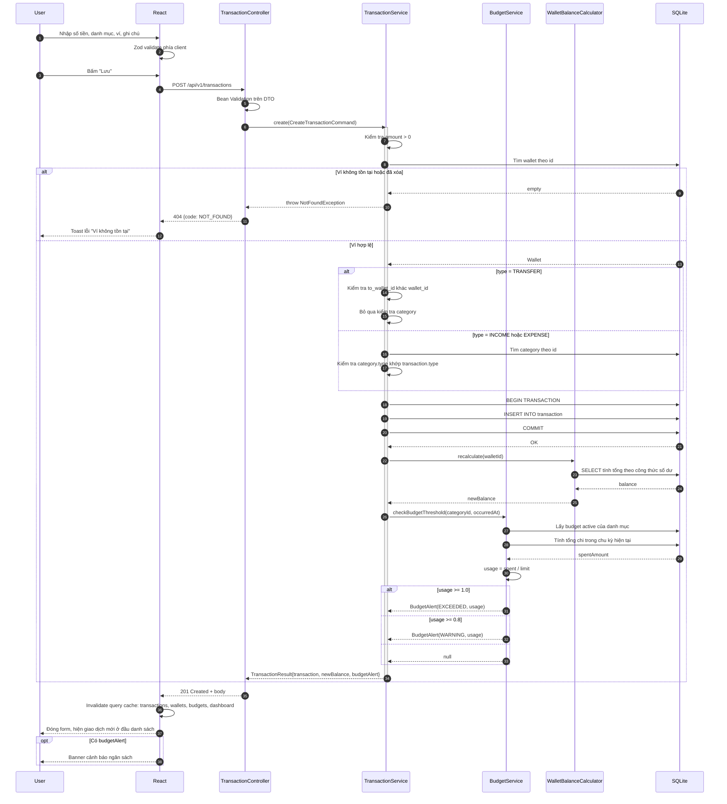
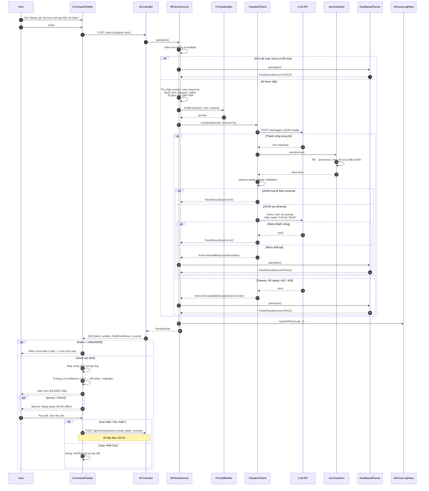
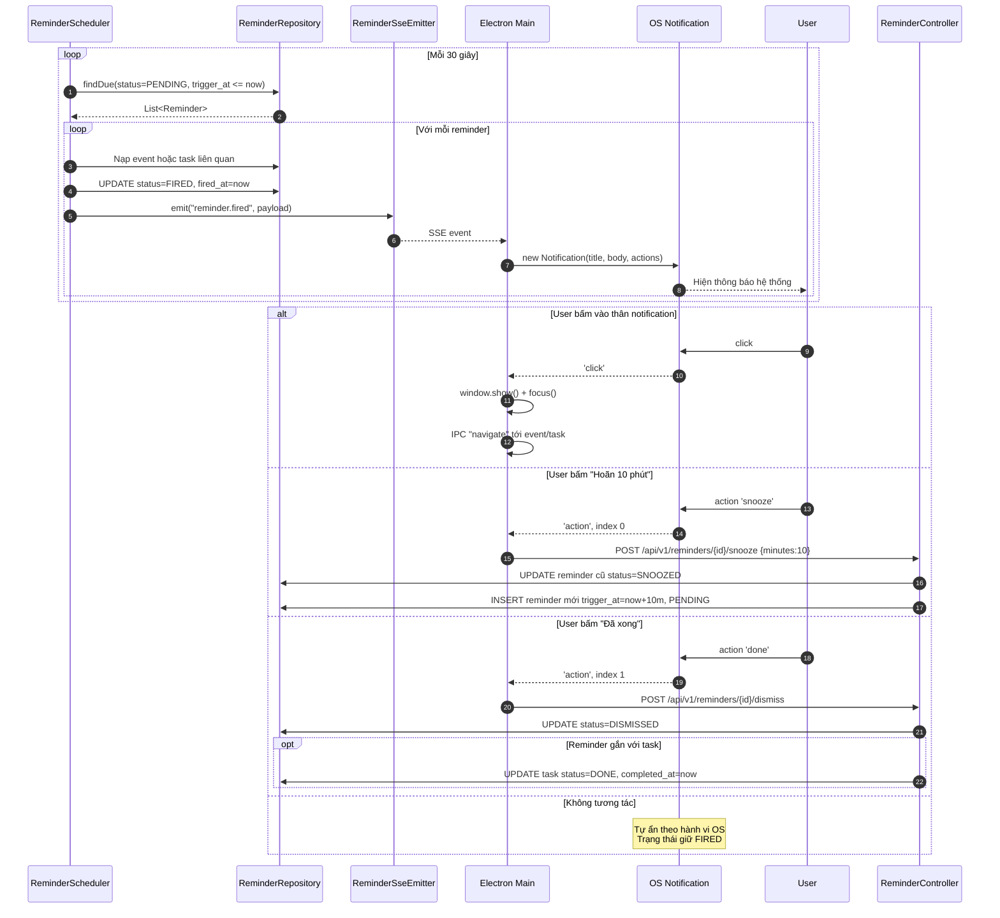
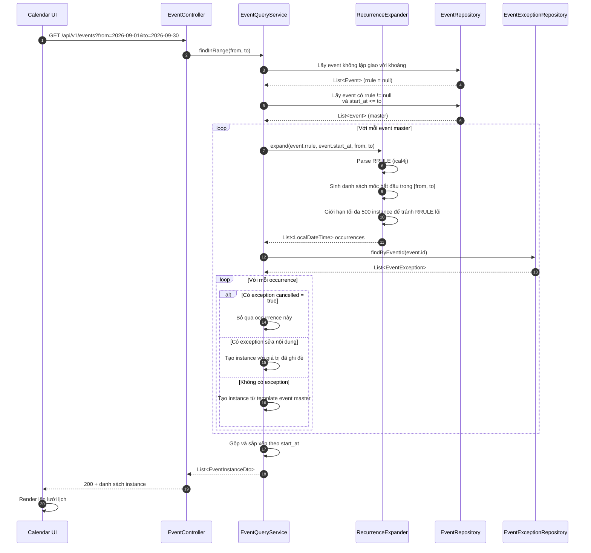
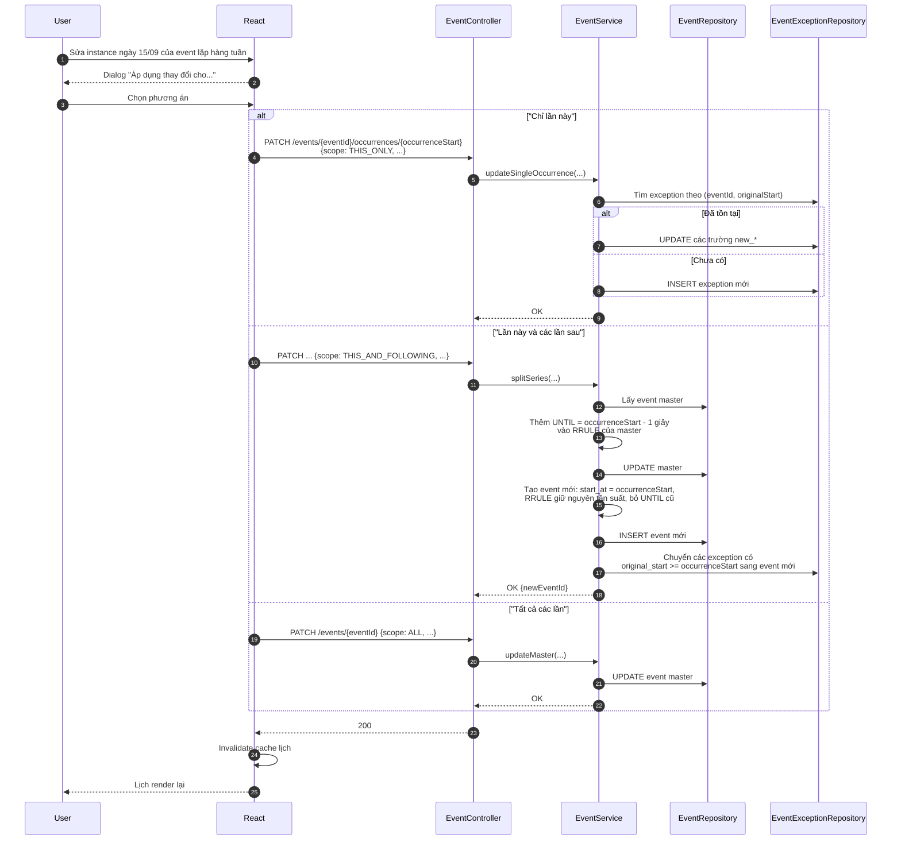
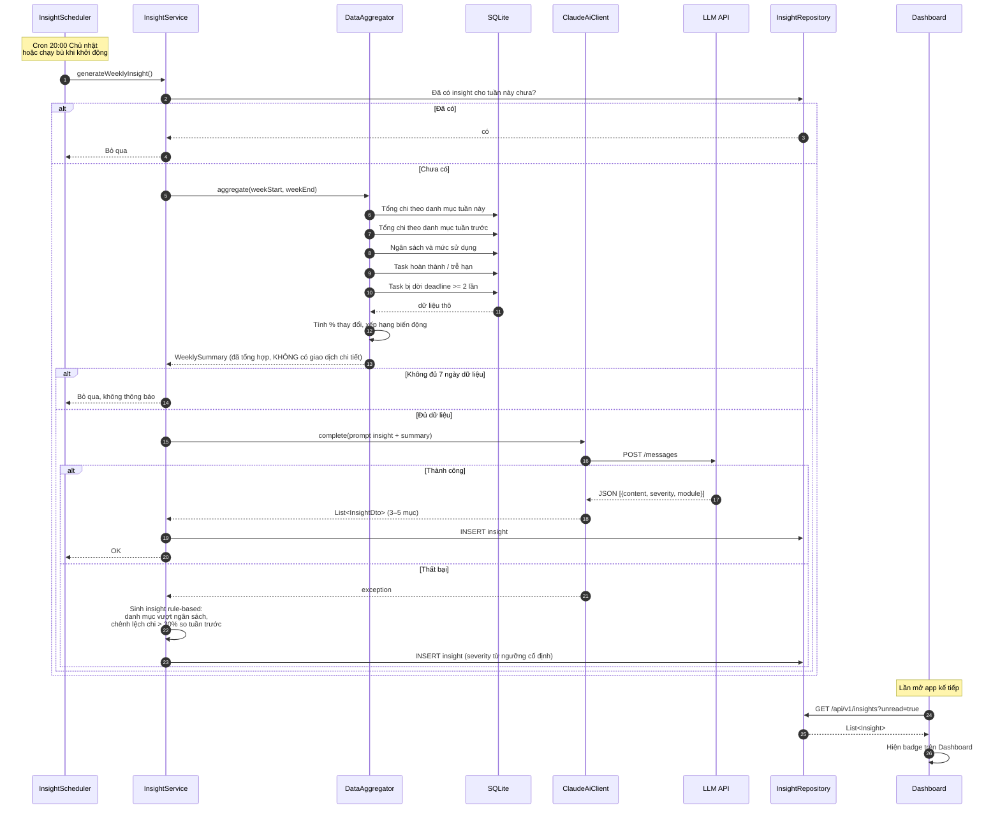
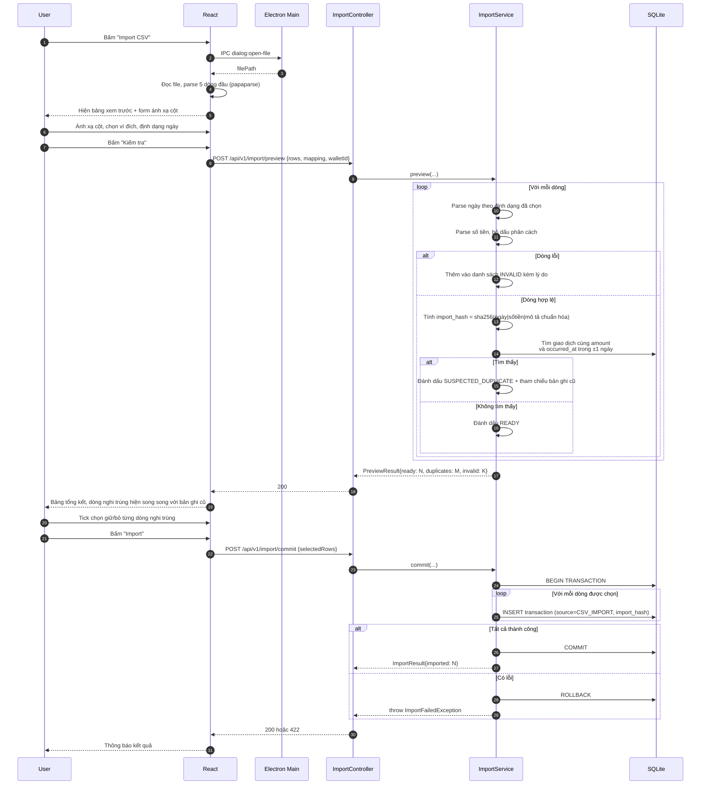
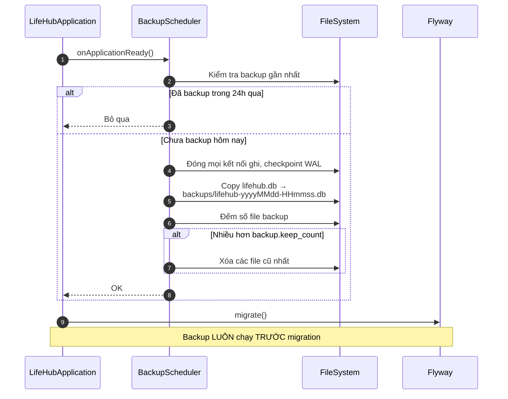

# 05 — Sequence Diagrams

Tài liệu này mô tả chi tiết các luồng phức tạp nhất. Agent phải implement đúng thứ tự và điều kiện rẽ nhánh mô tả ở đây.

---

## SD-01 — Ghi giao dịch chi tiêu (UC-06)

**Điểm cần chú ý khi implement:**
- Bước tính lại số dư và kiểm ngân sách nằm **ngoài** DB transaction ghi giao dịch. Nếu chúng lỗi, giao dịch vẫn phải được lưu thành công.
- Không tính lại số dư của tất cả các ví, chỉ ví bị ảnh hưởng (và ví đích nếu là TRANSFER).

---

## SD-02 — Nhập bằng ngôn ngữ tự nhiên có fallback (UC-09)

**Quy tắc tuyệt đối:** Không có đường nào từ `NlParseService` dẫn thẳng tới `TransactionService.create()`. Việc tạo bản ghi chỉ xảy ra khi frontend gửi request mới sau khi user bấm xác nhận.

---

## SD-03 — Scheduler bắn reminder (UC-04)

**Yêu cầu hiệu năng:** Chu kỳ 30 giây đảm bảo NFR-PERF-06 (độ trễ ≤ 30 giây). Query `findDue` phải dùng index `idx_reminder_pending`, không được quét toàn bảng.

---

## SD-04 — Sinh instance của event lặp lại

**Chi tiết quan trọng:**
- `EventInstanceDto` có 2 trường ID: `eventId` (của master) và `occurrenceStart` (mốc gốc của instance). Cặp này định danh duy nhất một instance. Frontend cần cả hai khi sửa/xóa.
- Giới hạn 500 instance là van an toàn chống RRULE vô hạn kiểu `FREQ=SECONDLY`.

---

## SD-05 — Sửa một instance của chuỗi lặp

---

## SD-06 — Sinh insight hàng tuần (UC-11)

**Quyền riêng tư:** Chỉ gửi số liệu đã tổng hợp lên AI (tổng theo danh mục, phần trăm thay đổi). Tuyệt đối không gửi từng giao dịch kèm ghi chú.

---

## SD-07 — Import CSV có chống trùng (UC-12)

---

## SD-08 — Backup tự động khi khởi động

**Thứ tự bắt buộc:** backup → migration → khởi động scheduler. Nếu migration hỏng dữ liệu, người dùng vẫn còn bản backup ngay trước đó.
